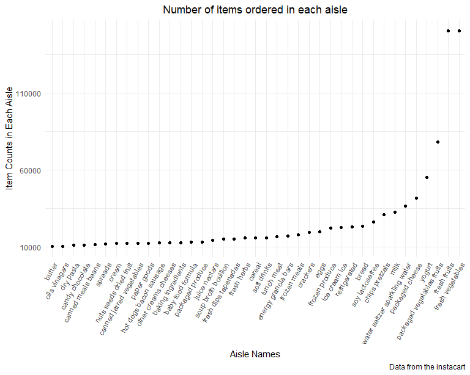

p8105_hw3_yw4251
================
You Wu
2023-10-10

# Problem 0

``` r
library(tidyverse)
```

    ## ── Attaching core tidyverse packages ──────────────────────── tidyverse 2.0.0 ──
    ## ✔ dplyr     1.1.3     ✔ readr     2.1.4
    ## ✔ forcats   1.0.0     ✔ stringr   1.5.0
    ## ✔ ggplot2   3.4.3     ✔ tibble    3.2.1
    ## ✔ lubridate 1.9.2     ✔ tidyr     1.3.0
    ## ✔ purrr     1.0.2     
    ## ── Conflicts ────────────────────────────────────────── tidyverse_conflicts() ──
    ## ✖ dplyr::filter() masks stats::filter()
    ## ✖ dplyr::lag()    masks stats::lag()
    ## ℹ Use the conflicted package (<http://conflicted.r-lib.org/>) to force all conflicts to become errors

``` r
library(p8105.datasets)
library(ggridges)

knitr::opts_chunk$set(
  fig.width = 6,
  fig.asp = .6,
  out.width = "90%"
)

theme_set(theme_minimal() + theme(legend.position = "bottom"))

options(
  ggplot2.continuous.colour = "viridis",
  ggplot2.continuous.fill = "viridis"
)

scale_colour_discrete = scale_colour_viridis_d
scale_fill_discrete = scale_fill_viridis_d
```

# Problem 1

``` r
data("instacart")
instacart
```

    ## # A tibble: 1,384,617 × 15
    ##    order_id product_id add_to_cart_order reordered user_id eval_set order_number
    ##       <int>      <int>             <int>     <int>   <int> <chr>           <int>
    ##  1        1      49302                 1         1  112108 train               4
    ##  2        1      11109                 2         1  112108 train               4
    ##  3        1      10246                 3         0  112108 train               4
    ##  4        1      49683                 4         0  112108 train               4
    ##  5        1      43633                 5         1  112108 train               4
    ##  6        1      13176                 6         0  112108 train               4
    ##  7        1      47209                 7         0  112108 train               4
    ##  8        1      22035                 8         1  112108 train               4
    ##  9       36      39612                 1         0   79431 train              23
    ## 10       36      19660                 2         1   79431 train              23
    ## # ℹ 1,384,607 more rows
    ## # ℹ 8 more variables: order_dow <int>, order_hour_of_day <int>,
    ## #   days_since_prior_order <int>, product_name <chr>, aisle_id <int>,
    ## #   department_id <int>, aisle <chr>, department <chr>

## How many aisles are there, and which aisles are the most items ordered from?

``` r
aisle_counts=
  instacart %>% 
  group_by(aisle) %>% 
  summarize(
    n_obs=n()
  ) %>% 
  arrange(-n_obs)
```

There are 134 aistles, and fresh vegetables are the most items ordered
from.

## Make a plot that shows the number of items ordered in each aisle, limiting this to aisles with more than 10000 items ordered. Arrange aisles sensibly, and organize your plot so others can read it.

``` r
aisle_counts %>% 
  filter(n_obs>10000) %>% 
  mutate(aisle = forcats::fct_reorder(aisle, n_obs)) %>% 
  ggplot(aes(x=aisle,y=n_obs))+
  geom_bar(stat = "identity",width=0.7)+
  labs(
    title = "Number of items ordered in each aisle",
    x = "Aisle Names",
    y = "Item Counts in Each Aisle",
    caption = "Data from the instacart")+
  scale_y_continuous(
    breaks = c(10000, 60000, 110000, 160000),
    labels = c("10000","60000", "110000","160000"))+
  theme(axis.text.x = element_text(angle = 60, hjust = 1))
```



## Make a table showing the three most popular items in each of the aisles “baking ingredients”, “dog food care”, and “packaged vegetables fruits”.

``` r
instacart %>% 
  filter(aisle%in% c("baking ingredients", "dog food care", "packaged vegetables fruits")) %>% 
  group_by(aisle,product_name) %>% 
  summarize(n_obs=n()) %>% 
  arrange(-n_obs) %>% 
  slice_head(n=3) %>% 
  mutate(rank = min_rank(desc(n_obs))) %>% 
  knitr::kable()
```

    ## `summarise()` has grouped output by 'aisle'. You can override using the
    ## `.groups` argument.

| aisle                      | product_name                                  | n_obs | rank |
|:---------------------------|:----------------------------------------------|------:|-----:|
| baking ingredients         | Light Brown Sugar                             |   499 |    1 |
| baking ingredients         | Pure Baking Soda                              |   387 |    2 |
| baking ingredients         | Cane Sugar                                    |   336 |    3 |
| dog food care              | Snack Sticks Chicken & Rice Recipe Dog Treats |    30 |    1 |
| dog food care              | Organix Chicken & Brown Rice Recipe           |    28 |    2 |
| dog food care              | Small Dog Biscuits                            |    26 |    3 |
| packaged vegetables fruits | Organic Baby Spinach                          |  9784 |    1 |
| packaged vegetables fruits | Organic Raspberries                           |  5546 |    2 |
| packaged vegetables fruits | Organic Blueberries                           |  4966 |    3 |

## Make a table showing the mean hour of the day at which Pink Lady Apples and Coffee Ice Cream are ordered on each day of the week.

``` r
instacart %>% 
  filter(product_name%in%c("Pink Lady Apples", "Coffee Ice Cream")) %>% 
  group_by(product_name,order_dow) %>% 
  summarize(mean_hour=mean(order_hour_of_day)) %>% 
  pivot_wider(names_from = order_dow,
              values_from=mean_hour) %>% 
  knitr::kable()
```

    ## `summarise()` has grouped output by 'product_name'. You can override using the
    ## `.groups` argument.

| product_name     |        0 |        1 |        2 |        3 |        4 |        5 |        6 |
|:-----------------|---------:|---------:|---------:|---------:|---------:|---------:|---------:|
| Coffee Ice Cream | 13.77419 | 14.31579 | 15.38095 | 15.31818 | 15.21739 | 12.26316 | 13.83333 |
| Pink Lady Apples | 13.44118 | 11.36000 | 11.70213 | 14.25000 | 11.55172 | 12.78431 | 11.93750 |

# Problem 2

``` r
data("brfss_smart2010")
```

``` r
cleaned_brfss=
  brfss_smart2010 %>% 
  janitor::clean_names() %>% 
  filter(topic=="Overall Health") %>% 
  mutate(response=factor(
    response,
    levels = c("Poor", "Fair", "Good", "Very good", "Excellent"),
    ordered = TRUE))
```

## In 2002, which states were observed at 7 or more locations? What about in 2010?

``` r
cleaned_brfss %>% 
  filter(year%in%c(2002,2010)) %>%
  group_by(year,locationabbr) %>% 
  summarize(n_loc=n_distinct(locationdesc)) %>% 
  filter(n_loc>=7) %>% 
  select(-n_loc) %>% 
  pivot_wider(
    names_from=year,
    values_from=locationabbr
  ) %>% 
  knitr::kable()
```

    ## `summarise()` has grouped output by 'year'. You can override using the
    ## `.groups` argument.

    ## Warning: Values from `locationabbr` are not uniquely identified; output will contain
    ## list-cols.
    ## • Use `values_fn = list` to suppress this warning.
    ## • Use `values_fn = {summary_fun}` to summarise duplicates.
    ## • Use the following dplyr code to identify duplicates.
    ##   {data} %>%
    ##   dplyr::group_by(year) %>%
    ##   dplyr::summarise(n = dplyr::n(), .groups = "drop") %>%
    ##   dplyr::filter(n > 1L)

| 2002                   | 2010                                                   |
|:-----------------------|:-------------------------------------------------------|
| CT, FL, MA, NC, NJ, PA | CA, CO, FL, MA, MD, NC, NE, NJ, NY, OH, PA, SC, TX, WA |

## Construct a dataset that is limited to Excellent responses, and contains, year, state, and a variable that averages the data_value across locations within a state. Make a “spaghetti” plot of this average value over time within a state (that is, make a plot showing a line for each state across years – the geom_line geometry and group aesthetic will help).

``` r
excel_cleaned_brfss=
  cleaned_brfss%>% 
  filter(response=="Excellent") %>% 
  group_by(year,locationabbr) %>% 
  summarize(avg_data_val=mean(data_value))
```

    ## `summarise()` has grouped output by 'year'. You can override using the
    ## `.groups` argument.

``` r
ggplot(excel_cleaned_brfss,aes(x=year,y=avg_data_val,color=locationabbr))+
  geom_line(size = 0.8,alpha=0.8)+
  theme_minimal()+
  theme(legend.text = element_text(size = 10))+
  labs(
    title = "Spaghetti Chart of Average Value over Time within States",
    x = "Year",
    y = "Average Data Values Across locations within State",
    caption = "Data from the Excellent Cleaned Brfss") 
```

    ## Warning: Using `size` aesthetic for lines was deprecated in ggplot2 3.4.0.
    ## ℹ Please use `linewidth` instead.
    ## This warning is displayed once every 8 hours.
    ## Call `lifecycle::last_lifecycle_warnings()` to see where this warning was
    ## generated.

    ## Warning: Removed 3 rows containing missing values (`geom_line()`).


## Make a two-panel plot showing, for the years 2006, and 2010, distribution of data_value for responses (“Poor” to “Excellent”) among locations in NY State.

``` r
ny_cleaned_brfss=
  cleaned_brfss %>% 
  filter(year%in%c(2006,2010)&locationabbr=="NY")

ggplot(ny_cleaned_brfss,aes(x=response,y=data_value))+
  geom_boxplot()+
  facet_grid(.~year)+
  labs(
    title = "Distribution of Response Values in NY State (2006 vs 2010)",
    y = "Data Value",
    x = "Ordered Response Level",
    caption = "Data from the NY Cleaned Brfss"
    ) +
  theme_minimal() +
  theme(
    panel.grid.major = element_line(colour = "gray", linetype = "dotted"),
    plot.title = element_text(hjust = 0.5)  # Centers the title
  )
```


