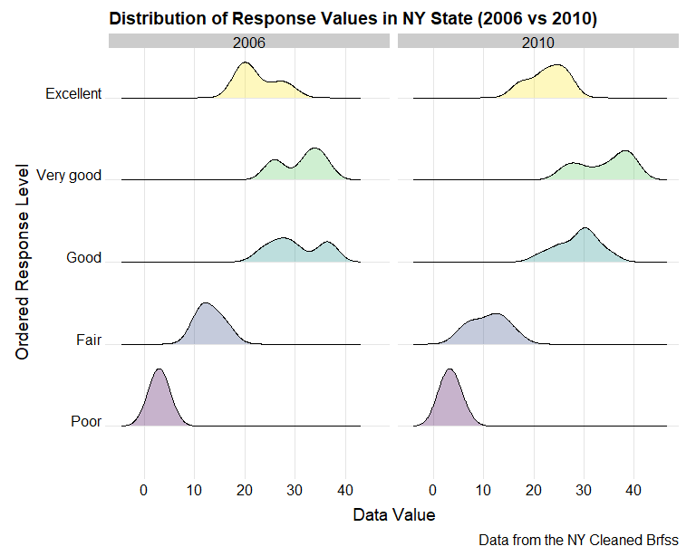
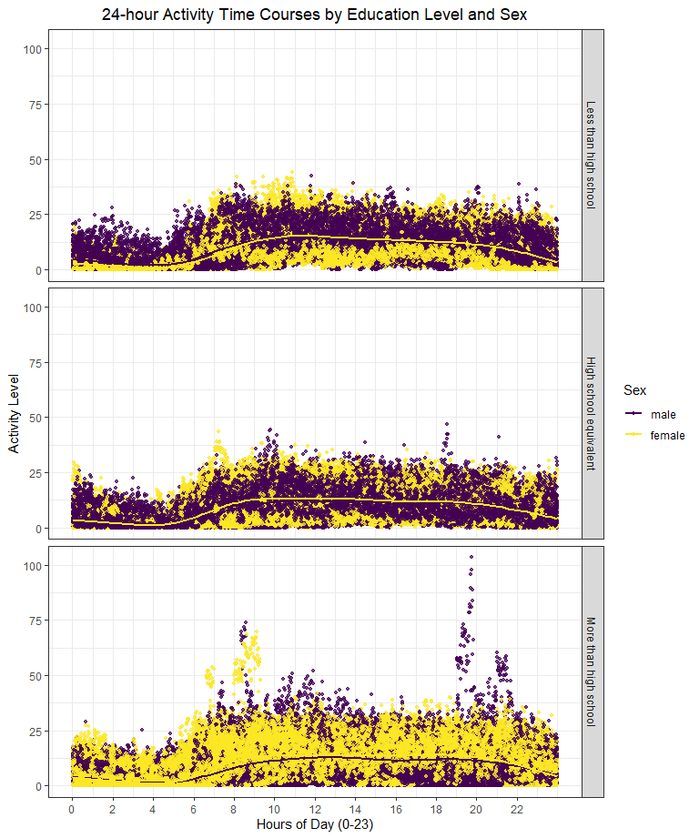

p8105_hw3_yw4251
================
You Wu
2023-10-10

# Problem 0

``` r
library(tidyverse)
```

    ## ── Attaching core tidyverse packages ──────────────────────── tidyverse 2.0.0 ──
    ## ✔ dplyr     1.1.3     ✔ readr     2.1.4
    ## ✔ forcats   1.0.0     ✔ stringr   1.5.0
    ## ✔ ggplot2   3.4.3     ✔ tibble    3.2.1
    ## ✔ lubridate 1.9.2     ✔ tidyr     1.3.0
    ## ✔ purrr     1.0.2     
    ## ── Conflicts ────────────────────────────────────────── tidyverse_conflicts() ──
    ## ✖ dplyr::filter() masks stats::filter()
    ## ✖ dplyr::lag()    masks stats::lag()
    ## ℹ Use the conflicted package (<http://conflicted.r-lib.org/>) to force all conflicts to become errors

``` r
library(p8105.datasets)
library(ggridges)
library(patchwork)

knitr::opts_chunk$set(
  fig.width = 8,
  fig.asp = .8,
  out.width = "90%"
)

theme_set(theme_minimal() + theme(legend.position = "bottom"))

options(
  ggplot2.continuous.colour = "viridis",
  ggplot2.continuous.fill = "viridis"
)

scale_colour_discrete = scale_colour_viridis_d
scale_fill_discrete = scale_fill_viridis_d
```

# Problem 1

First, load the data.

``` r
data("instacart")
instacart
```

    ## # A tibble: 1,384,617 × 15
    ##    order_id product_id add_to_cart_order reordered user_id eval_set order_number
    ##       <int>      <int>             <int>     <int>   <int> <chr>           <int>
    ##  1        1      49302                 1         1  112108 train               4
    ##  2        1      11109                 2         1  112108 train               4
    ##  3        1      10246                 3         0  112108 train               4
    ##  4        1      49683                 4         0  112108 train               4
    ##  5        1      43633                 5         1  112108 train               4
    ##  6        1      13176                 6         0  112108 train               4
    ##  7        1      47209                 7         0  112108 train               4
    ##  8        1      22035                 8         1  112108 train               4
    ##  9       36      39612                 1         0   79431 train              23
    ## 10       36      19660                 2         1   79431 train              23
    ## # ℹ 1,384,607 more rows
    ## # ℹ 8 more variables: order_dow <int>, order_hour_of_day <int>,
    ## #   days_since_prior_order <int>, product_name <chr>, aisle_id <int>,
    ## #   department_id <int>, aisle <chr>, department <chr>

## Description

This dataset contains 1384617 rows and 15 columns, where each row in the
dataset is a product from an order. Variables include identifiers for
user, order, and product; the order in which each product was added to
the cart. There are several order-level variables, describing the day
and time of the order, and number of days since prior order. Then there
are several item-specific variables, describing the product name
(e.g. Yogurt, Avocado), department (e.g. dairy and eggs, produce), and
aisle (e.g. yogurt, fresh fruits), and whether the item has been ordered
by this user in the past. In total, there are 39123 products found in
131209 orders from 131209 distinct users.

## How many aisles are there, and which aisles are the most items ordered from?

``` r
aisle_counts=
  instacart %>% 
  group_by(aisle) %>% 
  summarize(
    n_obs=n()
  ) %>% 
  arrange(-n_obs)
```

There are 134 aistles, and fresh vegetables are the most items ordered
from.

## Make a plot that shows the number of items ordered in each aisle, limiting this to aisles with more than 10000 items ordered. Arrange aisles sensibly, and organize your plot so others can read it. As shown:

Aisles are ordered by ascending number of items. The majority of aisles
have a low order count, close to the 10,000 mark or below. However, as
we move to the right side of the graph, there is a noticeable increase
in the number of items ordered for `fresh vegetables` and
`fresh fruits`.

``` r
aisle_counts %>% 
  filter(n_obs>10000) %>% 
  mutate(aisle = forcats::fct_reorder(aisle, n_obs)) %>% 
  ggplot(aes(x=aisle,y=n_obs))+
  geom_point()+
  labs(
    title = "Number of items ordered in each aisle",
    x = "Aisle Names",
    y = "Item Counts in Each Aisle",
    caption = "Data from the instacart")+
  scale_y_continuous(
    breaks = c(10000, 60000, 110000, 160000),
    labels = c("10000","60000", "110000","160000"))+
  theme(axis.text.x = element_text(angle = 60, hjust = 1),
        plot.title = element_text(hjust = 0.5))
```


## Make a table showing the three most popular items in each of the aisles “baking ingredients”, “dog food care”, and “packaged vegetables fruits”. As shown:

`Baking Ingredients Aisle`: Sweeteners like “Light Brown Sugar” and
leavening agents such as “Pure Baking Soda” and “Cane Sugar” are popular
choices.

`Dog Food Care Aisle`: Premium dog treats and high-quality dog food like
“Organic Chicken & Brown Rice Recipe” are favored.

`Packaged Vegetables Fruits Aisle`: Organic and healthy options like
“Organic Baby Spinach” and “organic berries” are in high demand.

``` r
instacart %>% 
  filter(aisle%in% c("baking ingredients", "dog food care", "packaged vegetables fruits")) %>% 
  group_by(aisle,product_name) %>% 
  summarize(n_obs=n()) %>% 
  arrange(-n_obs) %>% 
  slice_head(n=3) %>% 
  mutate(rank = min_rank(desc(n_obs))) %>% 
  knitr::kable()
```

    ## `summarise()` has grouped output by 'aisle'. You can override using the
    ## `.groups` argument.

| aisle                      | product_name                                  | n_obs | rank |
|:---------------------------|:----------------------------------------------|------:|-----:|
| baking ingredients         | Light Brown Sugar                             |   499 |    1 |
| baking ingredients         | Pure Baking Soda                              |   387 |    2 |
| baking ingredients         | Cane Sugar                                    |   336 |    3 |
| dog food care              | Snack Sticks Chicken & Rice Recipe Dog Treats |    30 |    1 |
| dog food care              | Organix Chicken & Brown Rice Recipe           |    28 |    2 |
| dog food care              | Small Dog Biscuits                            |    26 |    3 |
| packaged vegetables fruits | Organic Baby Spinach                          |  9784 |    1 |
| packaged vegetables fruits | Organic Raspberries                           |  5546 |    2 |
| packaged vegetables fruits | Organic Blueberries                           |  4966 |    3 |

## Make a table showing the mean hour of the day at which Pink Lady Apples and Coffee Ice Cream are ordered on each day of the week. As shown:

Pink Lady Apples tend to be purchased a bit earlier in the day compared
to Coffee Ice Cream, except for day 5

``` r
instacart %>% 
  filter(product_name%in%c("Pink Lady Apples", "Coffee Ice Cream")) %>% 
  group_by(product_name,order_dow) %>% 
  summarize(mean_hour=mean(order_hour_of_day)) %>% 
  pivot_wider(names_from = order_dow,
              values_from=mean_hour) %>% 
  knitr::kable(digits=2)
```

    ## `summarise()` has grouped output by 'product_name'. You can override using the
    ## `.groups` argument.

| product_name     |     0 |     1 |     2 |     3 |     4 |     5 |     6 |
|:-----------------|------:|------:|------:|------:|------:|------:|------:|
| Coffee Ice Cream | 13.77 | 14.32 | 15.38 | 15.32 | 15.22 | 12.26 | 13.83 |
| Pink Lady Apples | 13.44 | 11.36 | 11.70 | 14.25 | 11.55 | 12.78 | 11.94 |

# Problem 2

``` r
data("brfss_smart2010")
```

First, data cleaning. I standardize the column names, and filters rows
where the topic is “Overall Health”. It then reorders the responses in
the ‘response’ column into an ascending order of health quality. The
resulting cleaned data is stored in `cleaned_brfss`.

``` r
cleaned_brfss=
  brfss_smart2010 %>% 
  janitor::clean_names() %>% 
  filter(topic=="Overall Health") %>% 
  mutate(response=factor(
    response,
    levels = c("Poor", "Fair", "Good", "Very good", "Excellent"),
    ordered = TRUE))
```

## In 2002, which states were observed at 7 or more locations? What about in 2010? As shown:

In 2002, CT, FL, MA, NC, NJ, PA were observed at 7 or more locations; In
2010, CA, CO, FL, MA, MD, NC, NE, NJ, NY, OH, PA, SC, TX, WA were
observed at 7 or more locations.

``` r
cleaned_brfss %>% 
  filter(year%in%c(2002,2010)) %>%
  group_by(year,locationabbr) %>% 
  summarize(n_loc=n_distinct(locationdesc)) %>% 
  filter(n_loc>=7) %>% 
  select(-n_loc) %>% 
  pivot_wider(
    names_from=year,
    values_from=locationabbr
  ) %>% 
  knitr::kable()
```

    ## `summarise()` has grouped output by 'year'. You can override using the
    ## `.groups` argument.

    ## Warning: Values from `locationabbr` are not uniquely identified; output will contain
    ## list-cols.
    ## • Use `values_fn = list` to suppress this warning.
    ## • Use `values_fn = {summary_fun}` to summarise duplicates.
    ## • Use the following dplyr code to identify duplicates.
    ##   {data} %>%
    ##   dplyr::group_by(year) %>%
    ##   dplyr::summarise(n = dplyr::n(), .groups = "drop") %>%
    ##   dplyr::filter(n > 1L)

| 2002                   | 2010                                                   |
|:-----------------------|:-------------------------------------------------------|
| CT, FL, MA, NC, NJ, PA | CA, CO, FL, MA, MD, NC, NE, NJ, NY, OH, PA, SC, TX, WA |

## Construct a dataset that is limited to Excellent responses, and contains, year, state, and a variable that averages the data_value across locations within a state. Make a “spaghetti” plot of this average value over time within a state (that is, make a plot showing a line for each state across years – the geom_line geometry and group aesthetic will help). As shown:

The Spaghetti Plot displays the average values from 2002 to 2010 for
various U.S. states. It shows significant variability across states. A
noticeable trend is the dip in average values for many states around
2006, followed by a subsequent recovery. The values range between
approximately 15 and 30. There’s no uniform trend evident for all the
states across the shown years.

``` r
excel_cleaned_brfss=
  cleaned_brfss%>% 
  filter(response=="Excellent") %>% 
  group_by(year,locationabbr) %>% 
  summarize(avg_data_val=mean(data_value))
```

    ## `summarise()` has grouped output by 'year'. You can override using the
    ## `.groups` argument.

``` r
ggplot(excel_cleaned_brfss,aes(x=year,y=avg_data_val,color=locationabbr))+
  geom_line(size = 0.8,alpha=0.7)+
  theme_classic()+
  labs(
    title = "Spaghetti Chart of Average Value over Time by States",
    x = "Year",
    y = "Average Data Values Across locations within State") +
  theme(
    plot.title = element_text(hjust = 0.5),
    legend.text = element_text(size = 8),
    legend.position = "right",
    legend.key.size = unit(0.5, "cm")
  )
```

    ## Warning: Using `size` aesthetic for lines was deprecated in ggplot2 3.4.0.
    ## ℹ Please use `linewidth` instead.
    ## This warning is displayed once every 8 hours.
    ## Call `lifecycle::last_lifecycle_warnings()` to see where this warning was
    ## generated.

    ## Warning: Removed 3 rows containing missing values (`geom_line()`).


## Make a two-panel plot showing, for the years 2006, and 2010, distribution of data_value for responses (“Poor” to “Excellent”) among locations in NY State. As shown:

The distributions for the categories “Very good” and “Good” remain
relatively stable across both years, indicating a consistent perception
within these health categories. However, a more granular examination
reveals a subtle decline in the “Excellent” category by 2010 and a
concomitant increase in the “Poor” health category. These shifts, though
not drastic, suggest potential underlying changes in the health
landscape or in the subjective health evaluations of New Yorkers during
this period.

``` r
ny_cleaned_brfss=
  cleaned_brfss %>% 
  filter(year%in%c(2006,2010)&locationabbr=="NY")


ggplot(ny_cleaned_brfss,aes(x=data_value,y=response,fill=response))+
  geom_density_ridges(alpha=0.3,scale=0.7,bins=40)+
  facet_grid(~year)+
  labs(
    title = "Distribution of Response Values in NY State (2006 vs 2010)",
    x = "Data Value",
    y = "Ordered Response Level",
    caption = "Data from the NY Cleaned Brfss"
    ) +
  theme_ridges(font_size = 14)+
  theme(
    legend.position = "none",
    axis.title.x = element_text(hjust = 0.5),
    axis.title.y = element_text(hjust = 0.5)
  )
```

    ## Warning in geom_density_ridges(alpha = 0.3, scale = 0.7, bins = 40): Ignoring
    ## unknown parameters: `bins`

    ## Picking joint bandwidth of 2.1

    ## Picking joint bandwidth of 2.03



I also make a box plot to better investigate the distribution value
change. Both years show higher median values for “Good” and “Very good”
responses. The “Good” and “Very good” categories exhibit higher median
values compared to other health assessments. The “Excellent” category
sees an upward shift in 2010, while “Fair” remains stable across both
years. Notably, the “Poor” category has the lowest median values in both
years, with minimal variability. Overall, positive health perceptions
prevail, with minor changes between the two years.

``` r
ggplot(ny_cleaned_brfss,aes(x=response,y=data_value,fill=response))+
  geom_boxplot()+
  facet_wrap(~year)+
  labs(title="Distribution of Response Values in NY State (2006 vs 2010)",
       x="Response", 
       y="Data Value") +
  theme_minimal() +
  theme(axis.text.x = element_text(angle = 45, hjust = 1))
```


# Problem 3

``` r
covar_df=read_csv("data/nhanes_covar.csv",skip=4) %>% 
  janitor::clean_names() %>% 
  drop_na() %>%
  filter(age>=21) %>% 
  mutate(
    sex=as.factor(sex),
    sex=recode(sex, "1"="male", "2"="female"),
    education=factor(
      education,
      levels = c("1", "2", "3"),
      labels = c("Less than high school", "High school equivalent", "More than high school"),
      ordered = TRUE)
         )
```

    ## Rows: 250 Columns: 5
    ## ── Column specification ────────────────────────────────────────────────────────
    ## Delimiter: ","
    ## dbl (5): SEQN, sex, age, BMI, education
    ## 
    ## ℹ Use `spec()` to retrieve the full column specification for this data.
    ## ℹ Specify the column types or set `show_col_types = FALSE` to quiet this message.

``` r
accel_df=read_csv("data/nhanes_accel.csv") %>% 
  janitor::clean_names()
```

    ## Rows: 250 Columns: 1441
    ## ── Column specification ────────────────────────────────────────────────────────
    ## Delimiter: ","
    ## dbl (1441): SEQN, min1, min2, min3, min4, min5, min6, min7, min8, min9, min1...
    ## 
    ## ℹ Use `spec()` to retrieve the full column specification for this data.
    ## ℹ Specify the column types or set `show_col_types = FALSE` to quiet this message.

``` r
covar_add_accel=left_join(covar_df,accel_df,by="seqn") %>% 
  drop_na()
```

## Produce a reader-friendly table for the number of men and women in each education category, and create a visualization of the age distributions for men and women in each education category. Comment on these items.

``` r
covar_add_accel %>% 
  group_by(education,sex) %>% 
  summarize(count=n()) %>% 
  knitr::kable()
```

    ## `summarise()` has grouped output by 'education'. You can override using the
    ## `.groups` argument.

| education              | sex    | count |
|:-----------------------|:-------|------:|
| Less than high school  | male   |    27 |
| Less than high school  | female |    28 |
| High school equivalent | male   |    35 |
| High school equivalent | female |    23 |
| More than high school  | male   |    56 |
| More than high school  | female |    59 |

``` r
ggplot(covar_add_accel,aes(x=sex,y=age,fill=sex))+
  geom_boxplot(alpha=0.5)+
  facet_grid(~education) + 
  labs(
    title = "Age Distributions by Sex Across Education Categories",
    x = "Time",
    y = "Age",
    fill = "Sex"
    )+
  theme(
    plot.title = element_text(hjust = 0.5)
  )
```


## Traditional analyses of accelerometer data focus on the total activity over the day. Using your tidied dataset, aggregate across minutes to create a total activity variable for each participant. Plot these total activities (y-axis) against age (x-axis); your plot should compare men to women and have separate panels for each education level. Include a trend line or a smooth to illustrate differences. Comment on your plot.

``` r
covar_add_accel %>% 
  mutate(total_activity=rowSums(select(., min1:min1440))) %>%
  ggplot(aes(x=age,y=total_activity,color=sex))+
  geom_point()+
  geom_smooth(method = "lm", se = FALSE)+
  facet_grid(~education)+
   labs(
    title = "Total Activity by Age, Sex, and Education Level",
    x = "Age",
    y = "Total Activity",
    color = "Sex"
  )+
  theme(
    plot.title = element_text(hjust = 0.5)
  )
```

    ## `geom_smooth()` using formula = 'y ~ x'


## Accelerometer data allows the inspection activity over the course of the day. Make a three-panel plot that shows the 24-hour activity time courses for each education level and use color to indicate sex. Describe in words any patterns or conclusions you can make based on this graph; including smooth trends may help identify differences.

``` r
covar_add_accel %>% 
  pivot_longer(
    min1:min1440,
    names_to="minute",
    values_to="activity_level",
    names_prefix = "min"
  ) %>% 
  mutate(minute = as.numeric(minute) / 60) %>% 
  ggplot(aes(x=minute,y=activity_level,color=sex))+
  geom_point(alpha=0.7,size=1)+
  geom_smooth()+
  facet_grid(education~.)+
  labs(
    title = "24-hour Activity Time Courses by Education Level and Sex",
    x = "Hours of Day (0-23)",
    y = "Activity Level",
    color = "Sex"
  ) +
  theme(
    plot.title = element_text(hjust = 0.5)
  )+
  scale_x_continuous(
    breaks = seq(0, 23,2),
    labels = as.character(seq(0, 23,2)))
```

    ## `geom_smooth()` using method = 'gam' and formula = 'y ~ s(x, bs = "cs")'


